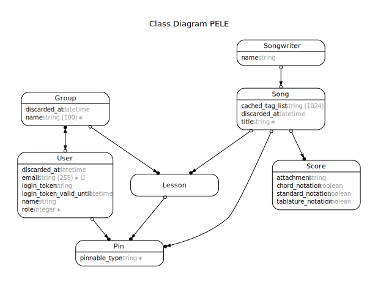

# PELE

[](https://travis-ci.org/bazzel/pele)

## Introduction

...

## Prerequisites

- Install [all requirements](https://gorails.com/setup/osx/10.15-catalina) on your machine
- PostgreSQL (instruction in the link above)
- [Heroku CLI](https://devcenter.heroku.com/articles/heroku-cli) (if you need to deploy the application, `$ brew tap heroku/brew && brew install heroku`)

## Installation

```
$ git clone https://github.com/bazzel/pele
$ cd pele
$ rbenv install `cat .ruby-version` # assuming you use rbenv.
$ bundle install
$ yarn install
$ cp .env.template .env
$ bin/rails db:setup
```

## Running / Development

- `$ bin/rails s`
- `$ bin/webpack-dev-server`
- Visit your app at [http://localhost:3000](http://localhost:3000).

### Populate the database

The project comes with a `seed.rb` which you can use to populate your development environment:

`$ bin/rails db:seed`

## Technical details

### Class diagram



To update the diagram, run the following command:

`$ bin/rails erd`

### S3

In [some environments](config/initializers/carrierwave.rb) images are uploaded to an S3 bucket using [CarrierWave](https://github.com/carrierwaveuploader/carrierwave). If you want to use this feature, make sure you have an S3 bucket created and add the required keys to the corresponding ENV variables:

- `AWS_ACCESS_KEY_ID`
- `AWS_SECRET_ACCESS_KEY`
- `AWS_REGION`
- `AWS_BUCKET_NAME`
